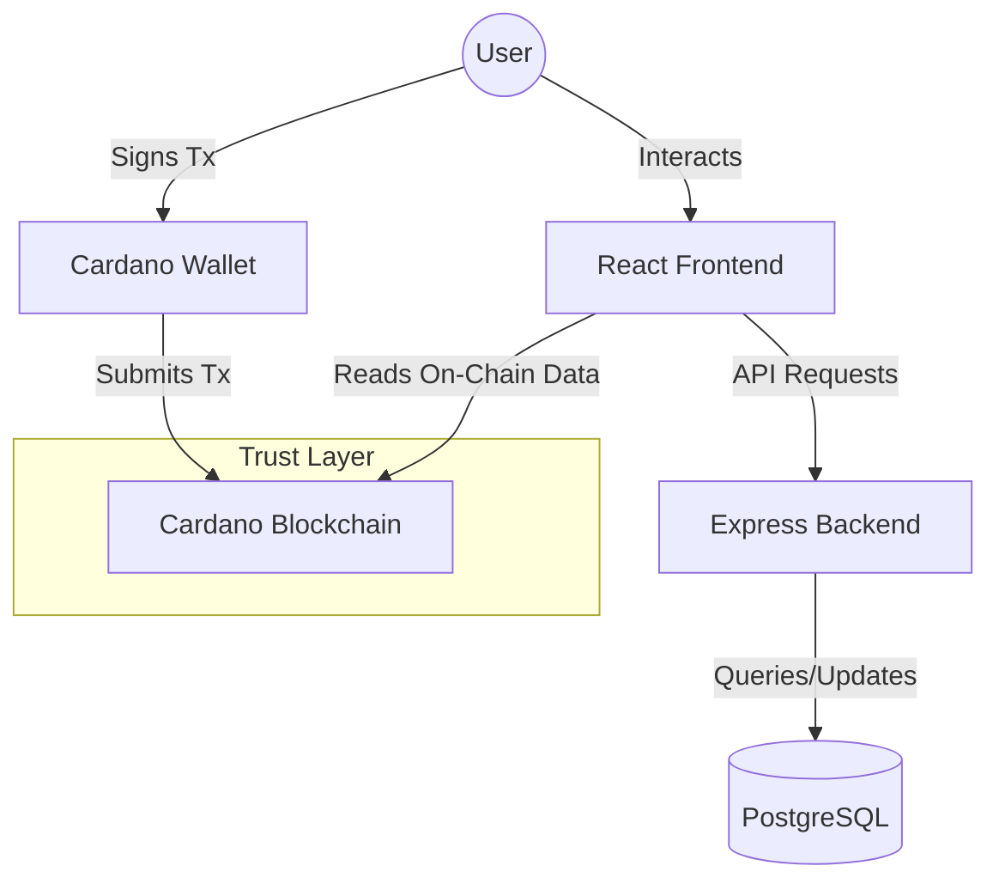

# StemTrust (ScienceTrust Nigeria) - Project Documentation
# Project Url: https://akimy.me


**Project:** StemTrust (ScienceTrust Nigeria)
**Location:** Abuja, Nigeria
**Goal:** A blockchain-based funding platform to restore trust in Nigerian STEM research.

---

## 1. Project Overview

StemTrust is a decentralized application (dApp) designed to bridge the trust gap between funders (government, NGOs, private sector) and researchers in Nigeria. By utilizing the Cardano blockchain, StemTrust ensures that research funding is transparent, milestone-based, and accountable.

### Key Problems Solved
*   **Opacity:** Traditional funding gets lost in bureaucracy; StemTrust tracks every penny on-chain.
*   **Trust Deficit:** Donors stop funding due to lack of visibility; StemTrust provides real-time evidence of progress.
*   **Inefficiency:** Grant "processing" takes months; StemTrust's smart contracts release funds instantly upon approval.

---

## 2. Architecture

The system is a hybrid application combining a standard Web2 stack for user experience with Web3 integration for critical trust layers (payments and governance).

### 2.1 Technology Stack

| Layer | Technologies | Purpose |
| :--- | :--- | :--- |
| **Frontend** | React, TypeScript, Vite, Tailwind CSS, Shadcn/UI | Responsive user interface and wallet interaction. |
| **Backend** | Node.js, Express, Prisma, PostgreSQL | User data, project metadata, off-chain storage. |
| **Blockchain** | Cardano (Preprod Testnet), MeshSDK, Plutus | Fund locking, milestone voting, transaction history. |
| **Storage** | PostgreSQL (Metadata), IPFS (Evidence - Planned) | Storing user profiles vs. storing proof of work. |

### 2.2 System Diagram



---

## 3. Core Features & Workflows

### 3.1 Authentication
*   **Dual Login:** Users can sign up via email/password (Web2) but must connect a Cardano wallet (Web3) for financial actions.
*   **Roles:**
    *   **Researcher:** Individual seeking funds.
    *   **Organization:** Entity (NGO, Gov) creating funding campaigns.
    *   **Community:** Public verifiers/voters.

### 3.2 Organization Workflow (The Funder)
1.  **Dashboard:** View active campaigns and funded projects.
2.  **Onboarding:** Create a new project entry.
    *   *Action:* Organization fills form -> Signs transaction sending ADA -> Backend creates project.
    *   *Trust:* Funds are locked only when the transaction is verified.
3.  **Management:** View evidence submitted by researchers and approve milestones.

### 3.3 Researcher Workflow (The Innovator)
1.  **Dashboard:** Track project status and funding progress.
2.  **Milestones:** Projects are broken into 3-10 stages (e.g., "Data Collection", "Prototype").
3.  **Evidence Submission:** upload photos, documents, or github links to prove work is done.
4.  **Payout:** Once evidence is approved (75% vote), the next tranche of funding is released.

### 3.4 Community Workflow (The Verifier)
1.  **Voting:** Stakeholders verified by the organization can vote "Approve" or "Reject" on evidence.
2.  **Transparency:** Anyone can view the funding history on the blockchain explorer.

---

## 4. Key Components

### `Backend/`
*   **`server.ts`**: Main entry point.
*   **`prisma/schema.prisma`**: Database schema defining Users, Projects, Milestones, and Votes.
*   **`src/routes/`**: API endpoints (e.g., `/api/projects`, `/api/auth`).
*   **`src/controllers/`**: Business logic for handling requests.

### `Frontend/`
*   **`src/components/WalletProvider.tsx`**: Manages connection to Nami, Eternl, etc.
*   **`src/components/OnboardProjectDialog.tsx`**: Critical flow where Organizations fund projects.
*   **`src/components/SubmitEvidenceDialog.tsx`**: Where researchers upload proof of work.
*   **`src/lib/api.ts`**: Centralized API client for communicating with the Backend.

---

## 5. Setup & Deployment

### 5.1 Docker (Recommended)
The entire stack is containerized for easy deployment.

```bash
# Start all services (Frontend, Backend, Database)
docker-compose up --build
```
*   Frontend: `http://localhost:5173`
*   Backend: `http://localhost:8080`

### 5.2 Manual Setup

**Backend:**
```bash
cd Backend
pnpm install
npx prisma generate
npx prisma db push
npm run dev
```

**Frontend:**
```bash
cd Frontend
npm install
npm run dev
```

---

## 6. Security Measures

1.  **Wallet-Based Identity:** Financial actions require cryptographic signatures, preventing spoofing.
2.  **Preprod Warning:** Explicit warnings added to UI to ensure users don't accidentally unauthorized Mainnet funds during testing.
3.  **Stateless Sessions:** Frontend does not store sensitive sessions; relies on secure tokens and wallet presence.
4.  **Transaction Verification:** Backend verifies `transactionHash` on-chain before activating projects.

---

## 7. Future Roadmap

*   **Smart Contract Automation:** Move the "Fund Release" logic ensuring 100% decentralized automation via Plutus contracts.
*   **IPFS Integration:** Fully replace backend storage for evidence with decentralized IPFS storage.
*   **DAO Governance:** Allow community token holders to vote on which projects get funded initially.

---
*Documentation created on December 9, 2024.*
