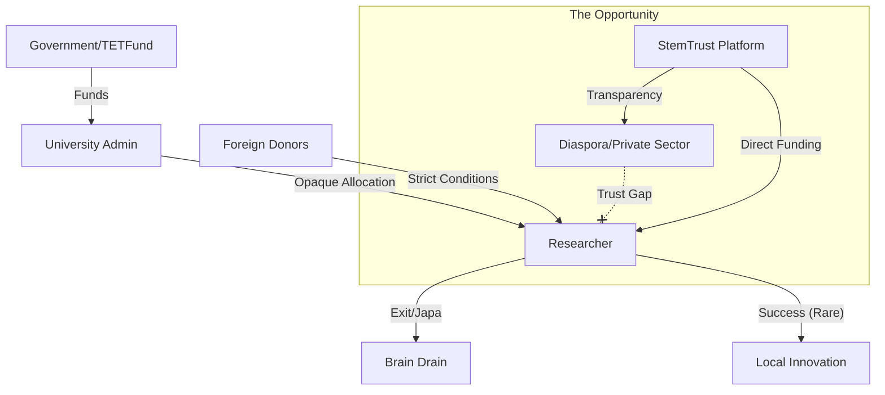

# Outcome 2: Stakeholder Map

**Concept:** Mapping the ecosystem of Research Funding in Abuja.

---

## 🗺️ The Map Layers

### 1. Caretakers (The Support System)
*People who hold the system together despite the challenges.*
*   **Department Heads (HODs):** Often use personal networks to secure small opportunities for students.
*   **Peer Review Groups:** Informal WhatsApp groups where researchers share calls for proposals.
*   **Lab Technicians:** Managing scarce resources to keep experiments running.

### 2. Stakeholders (The Institutions)
*The powerful players who control resources.*
*   **TETFund (Tertiary Education Trust Fund):** The primary government funding body (HQ in Abuja).
*   **National Universities Commission (NUC):** Regulatory body setting standards.
*   **University Administrations:** The gatekeepers of institutional grants.
*   **Foreign Embassies/Donors:** USAID, DFID, etc., offering competitive but limited grants.

### 3. Emerging Leaders (The Disrupters)
*New actors trying to change the narrative.*
*   **StemTrust Team:** Introducing blockchain transparency.
*   **Tech Hubs (e.g., Ventures Park):** Beginning to look at "Deep Tech" beyond just software.
*   **Student Research Associations:** Demanding more transparency in how fees/funds are used.
*   **Diaspora Nigerian Scientists:** Looking for trustworthy ways to give back.
*   **Cardano Community (Abuja Chapter):** promoting decentralized governance tools.

### 4. Affected Groups (The Victims)
*   **Early-Career Researchers:** Most vulnerable to "The Waiting Game."
*   **Post-Graduate Students:** Often delayed for years due to funding-related pauses.
*   **The Nigerian Public:** Denied local solutions to local problems (e.g., local agricultural, health innovations).

---

## 🕸️ Flow of Influence

